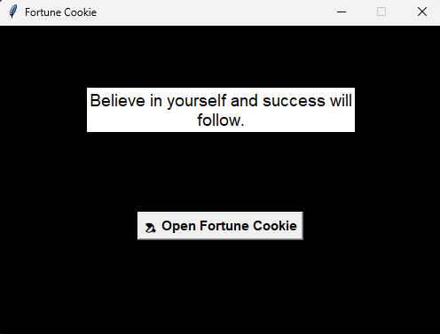

# 🥠 Fortune Cookie

A simple desktop application built with **Python** and **Tkinter** that displays a random motivational message whenever the user opens a fortune cookie.

This project was created as part of my Python GUI learning journey, focusing on event-driven programming, Tkinter widgets, and basic interface development.

---

## 📸 Screenshot



---

## ✨ Features

- Display a random motivational quote
- Interactive graphical interface
- Button-triggered events
- Simple and clean design
- Beginner-friendly implementation

---

## 🛠️ Technologies

- Python 3
- Tkinter
- Random (Python Standard Library)

---

## 📚 Concepts Practiced

- Object-Oriented Programming (OOP)
- Tkinter GUI development
- Event-driven programming
- Functions
- Lists
- Random selection
- Widget configuration
- Layout management with `pack()`

---

## 📂 Project Structure

```
fortune-cookie/
│
├── assets/
│   └── screenshot.png
│
├── main.py
├── README.md
└── requirements.txt
```

---

## ▶️ How to Run

Clone the repository:

```bash
git clone https://github.com/YOUR_USERNAME/Tkinter-GUI-Projects-Showcase.git
```

Navigate to the project folder:

```bash
cd "Fortune Cookie"
```

Run the application:

```bash
python main.py
```

---

## 🎯 Learning Objectives

This project was developed to practice:

- Creating graphical interfaces with Tkinter
- Working with Labels and Buttons
- Updating widgets dynamically
- Handling button click events
- Organizing a simple GUI application

---

## 🚀 Future Improvements

- Add fortune cookie images
- Improve the visual design
- Add opening animations
- Support multiple languages
- Create different quote categories

---

## 👨‍💻 Author

**Ana Caroline Vasconcellos**

NOC Analyst with a strong interest in Cybersecurity, Python development, automation, networking, and continuous learning through hands-on projects.
