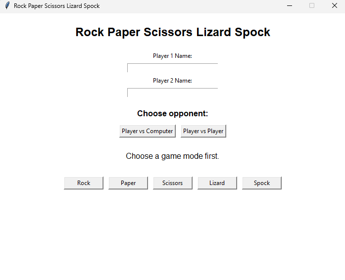

# 🎮 Rock Paper Scissors Lizard Spock

A desktop GUI application built with **Python** and **Tkinter** featuring the classic **Rock Paper Scissors Lizard Spock** game.

This project was developed to practice **GUI development**, **functions**, **conditional logic**, **dictionaries**, **lists**, **event-driven programming**, and **code organization**.

---

## 📸 Screenshot

<p align="center">
  
</p>

---

## ✨ Features

- 🖥️ Desktop graphical interface built with Tkinter
- 👤 Player vs Computer mode
- 👥 Player vs Player mode
- ✍️ Player name input
- 🎲 Random computer choice
- 🧠 Dictionary-based game logic
- 🤝 Draw detection
- 🎯 Clean and intuitive interface

---

## 🧠 Game Algorithm

```text
Player 1 chooses

        │
        ▼

Opponent chooses
(Player 2 or Computer)

        │
        ▼

Are both choices equal?

        │
   ┌────┴────┐
   │         │
  Yes        No
   │         │
   ▼         ▼

 Draw   Check the dictionary

              │
              ▼

Did Player 1 win?

        │
   ┌────┴────┐
   │         │
  Yes        No
   │         │
   ▼         ▼

Player 1 Wins   Player 2 Wins
```

### Logic Summary

1. Player 1 makes a choice.
2. The opponent (Computer or Player 2) makes a choice.
3. If both choices are equal, the game ends in a draw.
4. Otherwise, the program checks the `wins` dictionary.
5. If the opponent's choice is in Player 1's winning list, Player 1 wins.
6. Otherwise, Player 2 (or the Computer) wins.

---

## 🛠️ Technologies

- Python 3
- Tkinter

---

## 🚀 How to Run

Clone the repository:

```bash
git clone https://github.com/yourusername/tkinter-gui-projects.git
```

Go to the project folder:

```bash
cd rock-paper-scissors-lizard-spock
```

Create a virtual environment (optional):

### Linux / macOS

```bash
python3 -m venv .venv
source .venv/bin/activate
```

### Windows

```bash
python -m venv .venv
.venv\Scripts\activate
```

Install dependencies:

```bash
pip install -r requirements.txt
```

Run the application:

```bash
python main.py
```

---

## 📂 Project Structure

```text
rock-paper-scissors-lizard-spock/
│
├── assets/
│   └── screenshot.png
│
├── README.md
├── main.py
├── requirements.txt
└── .gitignore
```

---

## 📚 Concepts Practiced

- Functions
- Function parameters
- Return values
- Conditional statements (`if`, `elif`, `else`)
- Lists
- Dictionaries
- Random module
- Tkinter
- Labels
- Buttons
- Entry widgets
- Frames
- Event-driven programming
- GUI application development
- Code organization

---

## 🎯 Learning Objectives

This project was created to reinforce Python programming fundamentals while building a practical desktop application.

The main focus was to improve logical thinking by modeling game rules with a dictionary instead of relying on long chains of conditional statements. It also reinforces event-driven programming concepts and graphical interface development using Tkinter.
